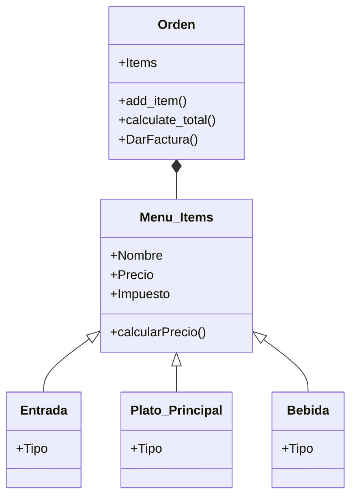

# Reto-tres

# Punto 1
**Problema:** 
Create a repo with the class exercise
# Solución Parte 1:
```python

import math

class Point:
    def __init__(self, x, y):
        self.x = x
        self.y = y

class Line:
    def __init__(self, start, end):
        self.start = start
        self.end = end
        self.length = self.compute_length()
        self.slope = self.compute_slope()

    def compute_length(self):
        dx = self.end.x - self.start.x
        dy = self.end.y - self.start.y
        return math.sqrt(dx**2 + dy**2)

    def compute_slope(self):
        dx = self.end.x - self.start.x
        dy = self.end.y - self.start.y
        if dx == 0:
            return float('inf')
        return math.degrees(math.atan(dy / dx))

    def compute_horizontal_cross(self):
        if self.start.y == 0 or self.end.y == 0:
            return True
        return False

    def compute_vertical_cross(self):
        if self.start.x == 0 or self.end.x == 0:
            return True
        return False

start_point = Point(0, 0)
end_point = Point(3, 4)
line = Line(start_point, end_point)
print("Length:", line.length)
print("Slope:", line.slope)
print("Horizontal Intersection:", line.compute_horizontal_cross())
print("Vertical Intersection:", line.compute_vertical_cross())

```


#Solución Parte 2:

```python

import math

class Point:
    def __init__(self, x, y):
        self.x = x
        self.y = y

class Line:
    def __init__(self, start, end):
        self.start = start
        self.end = end
        self.length = self.compute_length()
        self.slope = self.compute_slope()

    def compute_length(self):
        dx = self.end.x - self.start.x
        dy = self.end.y - self.start.y
        return math.sqrt(dx**2 + dy**2)

    def compute_slope(self):
        dx = self.end.x - self.start.x
        dy = self.end.y - self.start.y
        if dx == 0:
            return float('inf')
        return math.degrees(math.atan(dy / dx))

    def compute_horizontal_cross(self):
        if self.start.y == 0 or self.end.y == 0:
            return True
        return False

    def compute_vertical_cross(self):
        if self.start.x == 0 or self.end.x == 0:
            return True
        return False

class Rectangle:
    def __init__(self, top_line, right_line, bottom_line, left_line):
        self.top_line = top_line
        self.right_line = right_line
        self.bottom_line = bottom_line
        self.left_line = left_line

start_top_left = Point(1, 5)
end_top_right = Point(7, 5)
top_line = Line(start_top_left, end_top_right)

start_right_top = Point(7, 5)
end_right_bottom = Point(7, 1)
right_line = Line(start_right_top, end_right_bottom)

start_bottom_left = Point(1, 1)
end_bottom_right = Point(7, 1)
bottom_line = Line(start_bottom_left, end_bottom_right)

start_left_bottom = Point(1, 1)
end_left_top = Point(1, 5)
left_line = Line(start_left_bottom, end_left_top)

rectangle = Rectangle(top_line, right_line, bottom_line, left_line)
```


# Punto "
**Problema:** 
Restaurant scenario: You want to design a program to calculate the bill for a customer's order in a restaurant.
# Solución:



```python
class MenuItem:
    def __init__(self, name, price):
        self.name = name
        self.price = price

    def calculate_total(self, quantity):
        return self.price * quantity


class Beverage(MenuItem):
    def __init__(self, name, price, size):
        super().__init__(name, price)
        self.size = size


class Appetizer(MenuItem):
    def __init__(self, name, price, portion):
        super().__init__(name, price)
        self.portion = portion


class MainCourse(MenuItem):
    def __init__(self, name, price, protein):
        super().__init__(name, price)
        self.protein = protein


class Order:
    def __init__(self):
        self.items = []

    def add_item(self, item, quantity=1):
        self.items.append((item, quantity))

    def calculate_total(self):
        total = 0
        beverage_count = 0
        appetizer_count = 0
        main_course_count = 0

        for item, quantity in self.items:
            if isinstance(item, Beverage):
                beverage_count += 1
            elif isinstance(item, Appetizer):
                appetizer_count += 1
            elif isinstance(item, MainCourse):
                main_course_count += 1

            total += item.calculate_total(quantity)

        # Aplicar descuento si se pide al menos una bebida, una entrada y un plato principal
        if beverage_count >= 1 and appetizer_count >= 1 and main_course_count >= 1:
            discount = total * 0.1  
            total -= discount

        return total


if __name__ == "__main__":
    menu_items = [
        Beverage("Soda", 5000, "Regular"),
        Beverage("Cerveza", 10000, "Grande"),
        Appetizer("Nachos", 12000, "Grande"),
        Appetizer("Alitas de pollo", 15000, "12 piezas"),
        MainCourse("Hamburguesa", 20000, "Res"),
        MainCourse("Filete", 35000, "Ternera"),
        Beverage("Jugo", 6000, "Pequeño"),
        Appetizer("Ensalada César", 14000, "Individual"),
        MainCourse("Salmón a la parrilla", 30000, "Salmón"),
        MainCourse("Pasta Alfredo", 25000, "Pollo")
    ]

    order = Order()
    order.add_item(menu_items[0], 2) 
    order.add_item(menu_items[3])      
    order.add_item(menu_items[7])      

    total_bill = order.calculate_total()
    print("Total de la factura:", total_bill)

```
